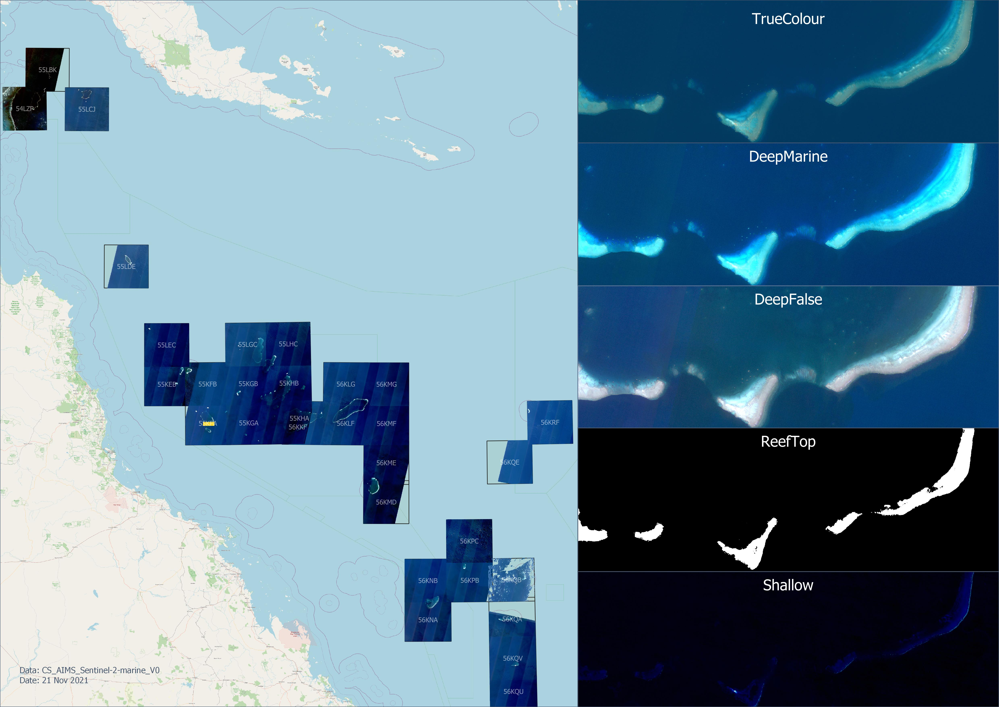
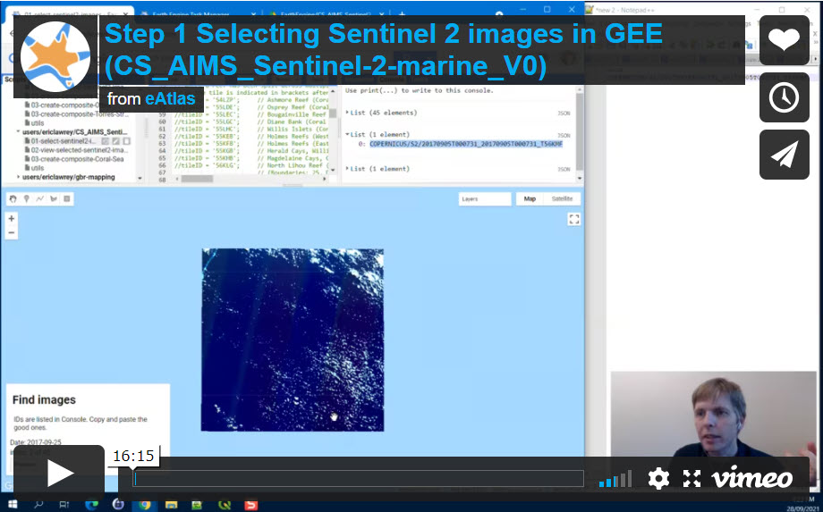
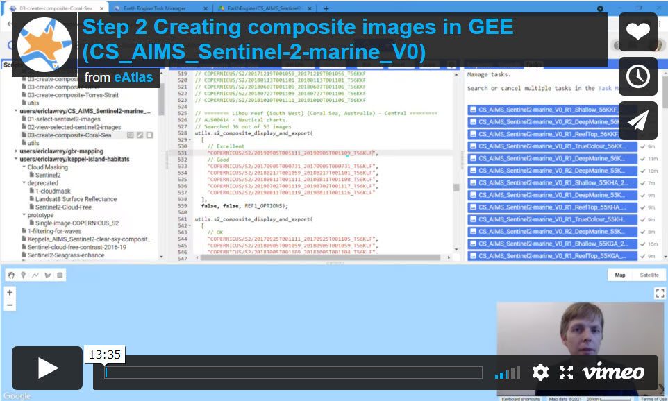
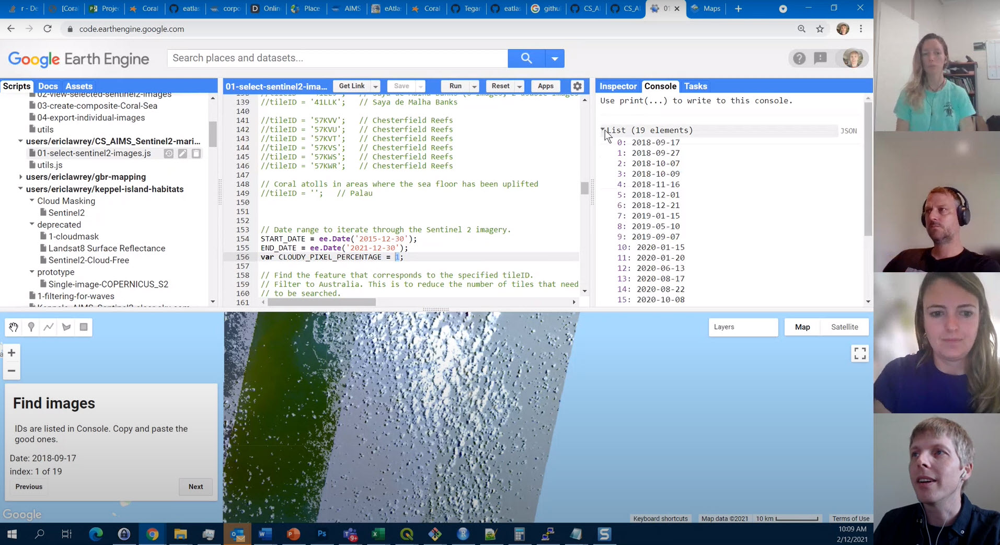

# Coral Sea Sentinel 2 marine composite images 2015 – 2021 (AIMS) - V0

Eric Lawrey – 21 November 2021

Australian Institute of Marine Science

This repository contains all the scripts used to create the Coral Sea
Sentinel 2 marine composite images. It includes the Google Earth Engine
javascript code and the Python scripts for subsequent post processing
of the imagery.

This repository is intended to allow others to reproduce and extend this
dataset. The scripts in this repository represent a draft version of this
dataset, as the composite imagery was only created from a partial review (50-70%)
of all the Sentinel 2 imagery. A future more refined version of this dataset 
will be published in approximately 6 months. When it is available it will be linked to
from here. 

No functional upgrades will be made to this repository as it represents about
snap shot of the processing that was used to create the dataset.

More information about this dataset can be found on the 
[Dataset metadata page](https://eatlas.org.au/data/uuid/2932dc63-9c9b-465f-80bf-09073aacaf1c)

## Dataset description

This dataset contains composite satellite images for the Coral Sea
region based on 10 m resolution Sentinel 2 imagery from 2015 – 2021. 

This collection contains composite imagery for 31 Sentinel 2 tiles in the Coral Sea. 
For each tile there are 5 different colour and contrast enhancement styles intended 
to highlight different features.

A preview of the dataset and the image styles. 

## Setup and installation
This dataset is created using the Google Earth Engine followed by some
file format adjustments using a Python script to process the imagery using
GDAL tools.

To reproduce this dataset from scratch you will need:
 - [Google Earth Engine account](https://earthengine.google.com/)
 - Python and GDAL installed (On Windows [OSGeo4W](https://www.osgeo.org/projects/osgeo4w/) is recommended)
 
The `01-sentinel2-tile-selection` folder contains a reference map that
was used to determine which Sentinel-2 tiles should be processed. It also
contains the previewing of the final imagery. However this imagery is not
part of this code repository due to its size (45GB). To ensure the imagery
works [download the dataset imagery](https://nextcloud.eatlas.org.au/apps/sharealias/a/cs-aims-sentinel-2-marine-v0) 
and save the imagery in the `finaldata` directory in subfolders for
each type of image style, i.e. `R1_DeepFalse`, etc.

The `02-gee-scripts` folder contains the scripts that should be
run on the Google Earth Engine. To set these up create a new Repository
and copy the scripts into the repo. Each script includes a description
of their purpose.

The `03-local-scripts` contains the scripts for converting the output
images from Google Earth Engine into the final imagery. More information
can be found in the [READMD.md](./03-local-scripts) file.

### Setting up a copy in Google Earth Engine

Running a copy of these scripts in your own Google Earth Account will allow
you to reproduce this dataseet, by also modify the scripts to apply
the techniques to area of your interest.

To run a copy of the Google Earth Engine scripts in your own account:
1. Create a Google Earth Account
2. Create a new repository to add the files to with `Scripts\NEW\Repository`.
3. Create an empty file with the name of each of the scripts in `src/02-gee-scripts` (such as `01-select-sentinel2-images.js`, etc) using `Scripts\NEW\File`. 
4. Copy and paste the code from the repository into these new files.
5. Change the path of the `utils` require statement to point at your copy of the code, replacing the `<username>` and `<repository name>` with your username and repository name. i.e. look for the line near the start of the code that looks like:
`var utils = require('users/ericlawrey/CS_AIMS_Sentinel2-marine_V0:utils');`
The `<username>` and `<repository name>` in this path need to be updated.
`var utils = require('users/<username>/<repository name>:utils');`

## Common Issues with using the code
### Error in Google Earth Engine: Cannot find required repo: users/ericlawrey/CS_AIMS_Sentinel2-marine_V0:utils
If you make a copy of the code in your own repository then you need to update the path to the `utils` script to point at your local copy. The `users/ericlawrey/CS_AIMS_Sentinel2-marine_V0:utils` is not public, thus can't be referenced from a copy. To fix this update the username and repository name to match your copy. 

### Does the `users/ericlawrey/World_ESA_Sentinel-2-tiling-grid` path need updating
This dataset is made public on the Google Earth Engine to allow it to be easily reused in the code and so its path does not need updating. You can find details of this dataset [here](https://code.earthengine.google.com/?asset=users/ericlawrey/World_ESA_Sentinel-2-tiling-grid)

## Videos

The following videos provide a walk through of the using the Google Earth Engine 
scripts to select good imagery then combine that imagery into a composite image 
for download.

 - Part 1 - Click to Watch!")

 - Part 2 - Click to Watch!")

 - Click to Watch!")

