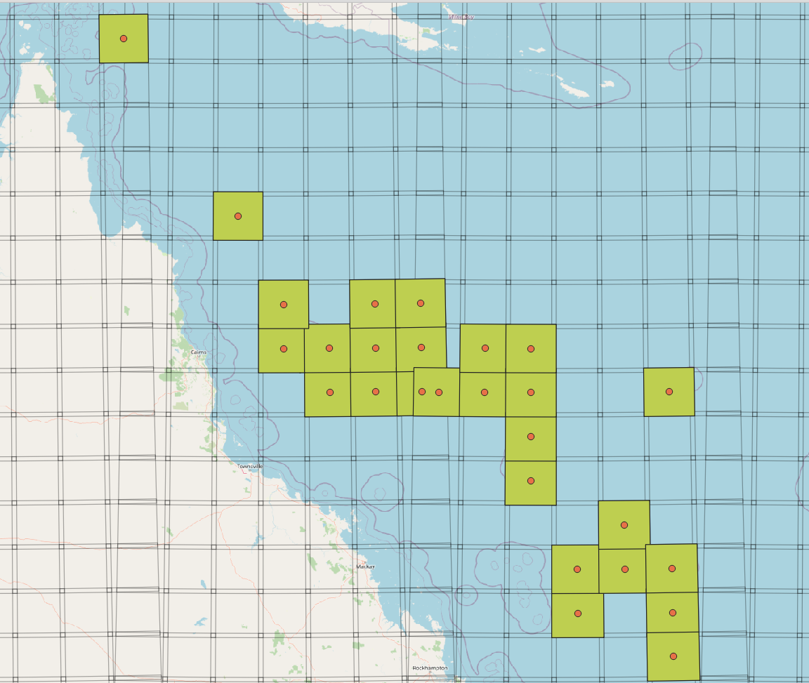
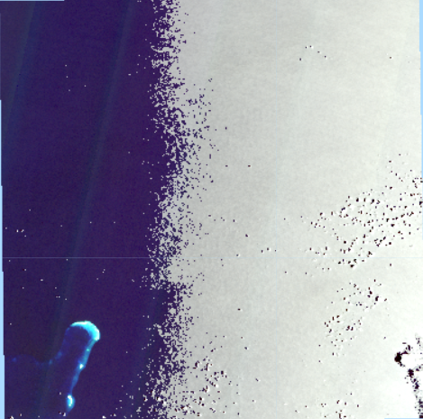
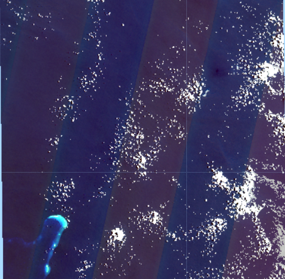
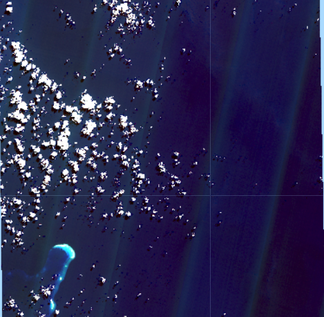
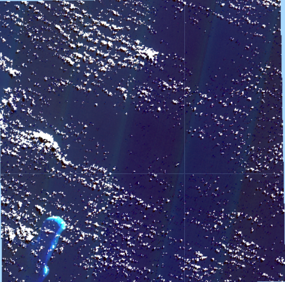

# Coral Sea Sentinel 2 marine composite images 2015 – 2021 (AIMS)

Eric Lawrey – 22 September 2021

Australian Institute of Marine Science

This repository contains all the scripts used to create the Coral Sea
Sentinel 2 marine composite images. It includes the Google Earth Engine
javascript code and the Python scripts for subsequent post processing
of the imagery.

This repository is intended to allow others to reproduce and extend this
dataset.

## Setup and installation
This dataset is created using the Google Earth Engine followed by some
file format adjustments using a Python script to process the imagery using
GDAL tools.

To reproduce this dataset from scratch you will need:
 - [Google Earth Engine account](https://earthengine.google.com/)
 - Python and GDAL installed (On Windows [OSGeo4W](https://www.osgeo.org/projects/osgeo4w/) is recommended)
 
The `01-sentinel2-tile-selection` folder contains a reference map that
was used to determine which Sentinel-2 tiles should be processed.

The `02-gee-scripts` folder contains the scripts that should be
run on the Google Earth Engine. To set these up create a new Repository
and copy the scripts into the repo. Each script includes a description
of their purpose.

The `02-gee-composites` contains the scripts for converting the output
images from Google Earth Engine into the final imagery. More information
can be found in the [READMD.md](./02-gee-composites) file.

## Dataset description

This dataset contains composite satellite images for the Coral Sea
region based on 10 m resolution Sentinel 2 imagery from 2015 – 2021. The
satellite imagery was processed in tiles (approximately 100 x 100 km) to
keep each final image small enough to manage. The dataset only covers
the portion of the Coral Sea where there are shallow coral reefs. This
dataset contains true colour imagery, a contrast enhanced version of the
imagery tailored for inspecting deep marine features, a reef tops layer
based on the red channel (B4) and a shallow features composite image
that focuses on identifying the boundaries of islands and cays as well
as near exposed reef areas.

The satellite image composite was created by combining multiple Sentinel
2 images using the Google Earth Engine. The core algorithm was:

1.  For each Sentinel 2 tile, Sentinel images from 2015 – 2021 were
    reviewed manually with cloud cover less than 0.5%. The Google Earth
    Engine image IDs the best images were recorded, those with the
    clearest water, lowest waves, lowest cloud, and lowest sun glint.
    Note that in the **Prototype version** of this dataset not all
    imagery was reviewed to save on time. Instead, good images were
    reviewed until four images were sourced. The review of the images
    was then stopped. As a result, this process gave a bias towards
    older imagery as the images are review in date order from oldest to
    newest.

2.  A composite image was created from the best images by taking the
    statistical median of the stack of images selected in the previous
    stage, after masking out clouds and their shadows (described in
    detail later).

3.  The contrast of the images was enhanced to create a series of
    products for different uses. The true colour image retained the full
    range of tones visible, so that sand cays still retained some
    detail. The marine enhanced version stretched the blue, green and
    red channels so that they focused on the deeper, darker marine
    features. This stretching was done to ensure that when converted to
    8-bit colour imagery that all the dark detail in the deeper areas
    were visible. This contrast enhancement resulted in bright areas of
    the imagery clipping, leading to loss of detail in shallow reef
    areas and colours of land areas looking off. A reef top estimate was
    produced from the red channel (B4) where the contrast was stretched
    so that the imagery contains almost a binary mask. The threshold was
    chosen to approximate the 5 m depth contour for the clear waters of
    the Coral Sea.

4.  The various contrast enhanced composite images were exported from
    Google Earth Engine (default of 32 bit GeoTiff) and reprocessed to
    smaller LZW compresed 8 bit GeoTiff images GDAL.

## Coverage

This dataset only contains Sentinel 2 scenes in the Coral Sea where
there are shallow coral reefs.

## Cloud Masking

Prior to combining the best images each image was processed to mask out
clouds and their shadows.

The cloud masking uses the COPERNICUS/S2_CLOUD_PROBABILITY dataset
developed by SentinelHub (Google, n.d.; Zupanc, 2017). The mask includes
the cloud areas, plus a mask to remove cloud shadows. The shadows are
estimated by projecting the cloud mask in the direction opposite the
angle to the sun. The shadow distance was estimated in two parts.

A low cloud mask was created based on the assumption that small clouds
have a small shadow distance. These were detected using a 40% cloud
probability threshold. These were projected over 400 m, followed by a
150 m buffer to expand the final mask.

A high cloud mask was created to cover longer shadows created by taller,
larger clouds. These clouds were detected based on an 80% cloud
probability threshold, followed by an erosion and dilation of 300 m to
remove small clouds. These were then projected over a 1.5 km distance
followed by a 300 m buffer.

Erosion, dilation and buffer operations were performed at a lower than
the satellite image resolution to improve the computational speed. The
resolution of these operations were adjusted so that they were
represented by approximately 4 pixels during these operations. This
means that the cloud mask is significantly more spatially coarse than
the 10 m Sentinel imagery. This resolution was chosen as a trade-off
between the coarseness of the mask verse the processing time for these
operations. With 4-pixel filter resolutions these operations were still
using over 90% of the total processing resulting in each image taking
approximately 10 min to compute on the Google Earth Engine.

## Sun glint removal

Sun glint was removed from the images using the infrared B8 band to
estimate the reflection off the water from the sun glint. B8 penetrates
water less than 0.5 m and so in water areas it only detects reflections
off the surface of the water. The sun glint detected by B8 correlates
very highly with the sun glint experienced by the visible channels (B2,
B3 and B4) and so the sun glint in these channels can be removed by
subtracting B8 from the visible channels (B2, B3 and B4). One
complication is that the B8 channel is typically very bright on land
areas as they strongly reflect the infrared. As a result, simply
subtracting B8 from the visible channels results in land areas becoming
black. To partly compensate for this we scale and limit the B8 so that
there is a maximum amount of B8 sun glint compensation and in areas
where B8 is very bright we assume that it corresponds to land areas and
thus we reduce the B8 sun glint compensation. This approach has its
limitations, on land it makes some images very dark, and it also creates
abrupt brightness changes in the transition between land and water. In
some cases, it cases black edging around islands, and in others it makes
shallow sand / mud bars (that are dry enough to be considered as land)
artificially brighter than the surrounding slightly submerged parts of
the bars.

## Image selection

Images were excluded from the composites primarily due to two main
factors: sunglint and fine scattered clouds. The images were excluded if
there was any significant uncorrected sunglint in the image, i.e. the
brightness of the sunglint exceeded the sunglint correction. Find
scattered clouds over reef areas were also a strong factor in down
grading the quality rating of the image. Small clouds result in either
small tonal abnormities from the hole created by the cloud masking, or
they result in tonal variation if they are not detected by the cloud
masking. The high level of contrast enhancement applied to detect deep
marine features stretches any small tonal differences due to cloud
masking (a hole in the image, resulting in the median being estimated
from a smaller number of images), or a non-masked cloud and create false
features in the images.

As each satellite images were reviewed they were characterised into four
classes:

-   Excellent – Almost perfectly cloud free.

-   Good – Large sections of the imagery are cloud free, particularly
    areas of reefs, and there is no remaining sunglint. Clouds in the
    image are low and not very small.

-   OK – Moderate areas of the image are cloud free (>30 %),
    particularly where there are reefs. No remaining sunglint (after
    correction).

-   Maybe – Some useful areas of imagery are visible and with enough
    images the clouds in the image might be able to be removed. Images
    that have lots of very small clouds are still generally excluded. No
    significant sunglint (\<5%) after correction in the image.

*Excluded due to uncorrected sunglint in over half the image.*

*Characterised as OK because almost none of the cloud overlaps with the 
reef area. The fine scattered clouds are unlikely to be fully masked from 
the image and thus will contribute noise into the final image.*

*Classified as 'Maybe' because the clouds significantly overlap with the 
reef area. The clouds over the reef area are reasonably large and thus 
are likely to be effectively masked out during the composition process.*

*Excluded because of the fine clouds over the reef areas.*

The images were then grouped into two reference images. The first
reference images contained the best set of images (typically the Good
and OK images) and the second reference image made up of the remaining
images (typically from the Maybe category). If there were enough
Excellent, Good or OK images then the Maybe category images were unused.

For this version of the dataset typically 40 – 60 images were previewed,
representing approximately 50 – 80% of the available images. Where a
scene was split over two satellite passes more images were previewed and
collated to ensure that there were enough images in both the left and
right sections of the image tile. A minimum of 4 images were combined
for OK and Good classification and typically 6 – 8 used for images of
the Maybe category.

## Imperfect image blending

The final composite image for each tile is produced by taking the median
of the stack of the best images, after masking for clouds and sun glint
removal. This algorithm works well when there are enough images (> 10)
that the median provides a good statistical estimate of the typical
colour of each pixel. Depending on the season and the water conditions
the colours and brightness of images can vary significantly. When there
are only a few images available in the stack then areas masked out by
clouds result in significant local shifts in colour, resulting in a
patchy final image, with patches corresponding to the shapes of the
clouds.

## References

Google (n.d.) Sentinel-2: Cloud Probability. Earth Engine Data Catalog.
Accessed 10 April 2021 from
<https://developers.google.com/earth-engine/datasets/catalog/COPERNICUS_S2_CLOUD_PROBABILITY>

Zupanc, A., (2017) Improving Cloud Detection with Machine Learning.
Medium. Accessed 10 April 2021 from
<https://medium.com/sentinel-hub/improving-cloud-detection-with-machine-learning-c09dc5d7cf13>

pandoc --extract-media=media -f docx -t markdown
2021-09-22_CS_AIMS_Sentinel2-marine_V0_Metadata.docx -o metadata.md
